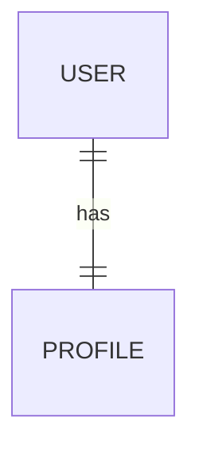
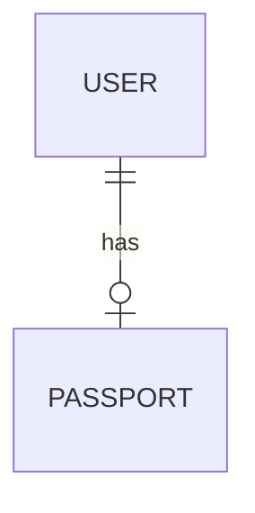
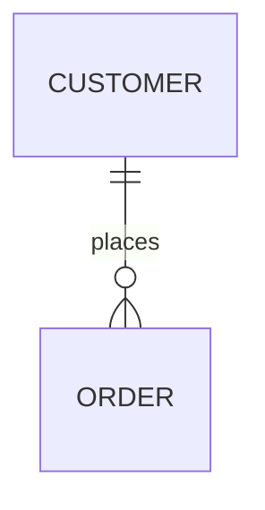
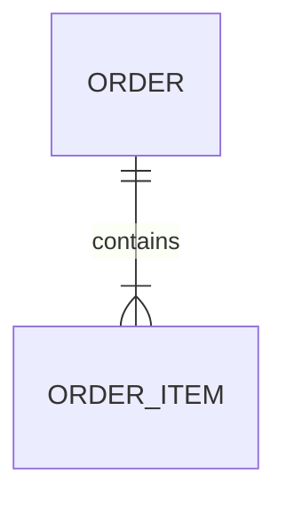
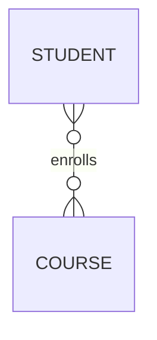
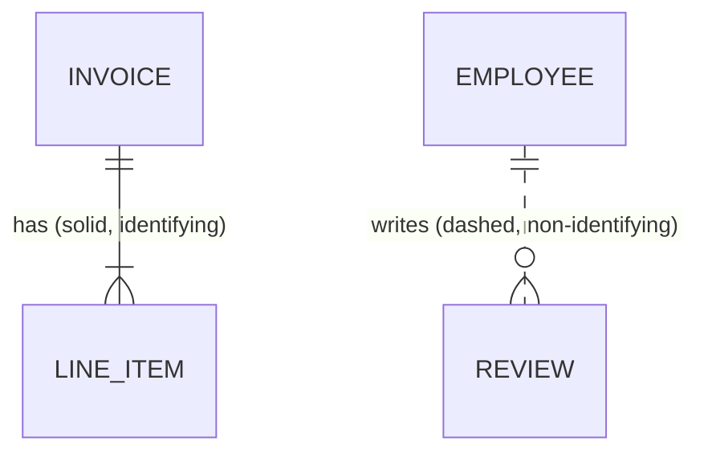
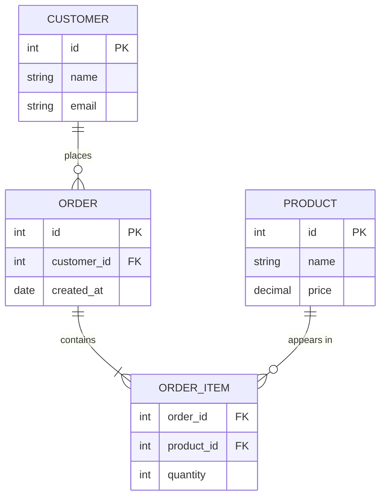

# 💚 ER Diagram Basics

## 💛 What is it?
An **ER diagram (Entity-Relationship diagram)** is a picture of your data model. It shows the things you store, the facts about each thing, and how they connect.
Plain version: it is the blueprint of your database before you write a single `CREATE TABLE`. Boxes are tables, lines are relationships.
You draw it to agree on the shape of the data with your team, then translate it into real tables.
## 💛 Why do we need it?
- **Think before you build.** Fixing a bad schema after data is live is painful. A diagram catches design mistakes early, on a whiteboard, for free.
- **Shared language.** Backend, frontend, and product can all look at one picture and agree what an "Order" is and what it links to.
- **Spot the relationships.** It makes the tricky parts obvious: which side holds the foreign key, where you need a join table, what can exist without what.
### 🤍 Real-world use case
Before building a store, you sketch: a Customer places many Orders, each Order contains many Products. That one sentence becomes the diagram below, which becomes your tables.
## 💛 The building blocks
- **Entity**: a thing you store. Becomes a table. Example: `Customer`, `Order`, `Product`. Drawn as a box.
- **Attribute**: a fact about an entity. Becomes a column. Example: a Customer has `name`, `email`.
- **Primary key (PK)**: the column that uniquely identifies a row. Example: `Customer.id`.
- **Foreign key (FK)**: a column that points at another table's PK. This is what actually wires two tables together. Example: `Order.customer_id` points at `Customer.id`.
- **Relationship**: the line between two entities, describing how they relate (a Customer places Orders).
## 💛 Cardinality (the most important part)
Cardinality is "how many of each side relate to the other." Three basic kinds:
- **One-to-one (1:1)**: one row here matches at most one row there. Example: a User and their UserProfile.
- **One-to-many (1:N)**: one row here matches many rows there. Example: one Customer has many Orders. This is the most common.
- **Many-to-many (M:N)**: many match many. Example: Orders and Products (an order has many products, a product appears in many orders).
### 🤍 Reading crow's foot notation
Most tools use "crow's foot" symbols at the ends of the line. The symbol nearest an entity describes that side.
```javascript
||   exactly one
o|   zero or one
}|   one or many
}o   zero or many

Example line:  CUSTOMER ||--o{ ORDER
  reads: one CUSTOMER has zero-or-many ORDERs,
         each ORDER belongs to exactly one CUSTOMER.
```
### 🤍 Each notation
The symbol touching an entity describes that entity's side. Here is how each common relationship actually renders.
**Exactly one to exactly one (1:1).** A User has exactly one Profile, and each Profile belongs to one User:

**Optional one (zero or one).** A User may have one Passport, or none:

**One to zero-or-many (1:N).** A Customer can have any number of Orders, possibly none:

**One to one-or-many (1:N, at least one).** An Order must contain at least one Order Item:

**Many to many (M:N).** A Student enrolls in many Courses, and a Course has many Students:

**Identifying vs non-identifying.** A solid line means the child cannot exist without its parent (the parent's key is part of the child's identity). A dashed line means the child can exist on its own:

### 🤍 Full example diagram (Mermaid)

Notice `ORDER_ITEM`. It exists only to connect Orders and Products. That is the key trick below.
## 💛 The many-to-many trick (junction table)
A relational database cannot store a many-to-many relationship directly. You break it into two one-to-many relationships using a **junction table** (also called a join or bridge table).
- Orders to Products is many-to-many.
- So you add `ORDER_ITEM` in the middle. It holds `order_id` (FK) and `product_id` (FK).
- Now: one Order has many Order Items, one Product has many Order Items. Two clean 1:N relationships instead of one messy M:N.
The junction table is also the natural home for facts about the pairing, like `quantity`.
## 💛 Gotcha
- **The FK lives on the "many" side.** In one-to-many, the foreign key goes on the child (`Order.customer_id`), never on the parent. Getting this backwards is the most common beginner mistake.
- **Every many-to-many needs a junction table.** If you cannot see where the FK would go, that is the signal you need one.
- **PK vs unique.** A primary key is unique AND not null AND the row's identity. A column can be unique without being the primary key (e.g. `email`).
- **Logical vs physical.** An early ER diagram can be "logical" (just entities and relationships). The "physical" version adds exact column types, indexes, and constraints. Do not over-detail the first draft.
## 💛 References
- Mermaid ER diagram syntax: https://mermaid.js.org/syntax/entityRelationshipDiagram.html
- Lucidchart: ER diagram guide: https://www.lucidchart.com/pages/er-diagrams
- PostgreSQL: constraints (PK / FK): https://www.postgresql.org/docs/current/ddl-constraints.html
