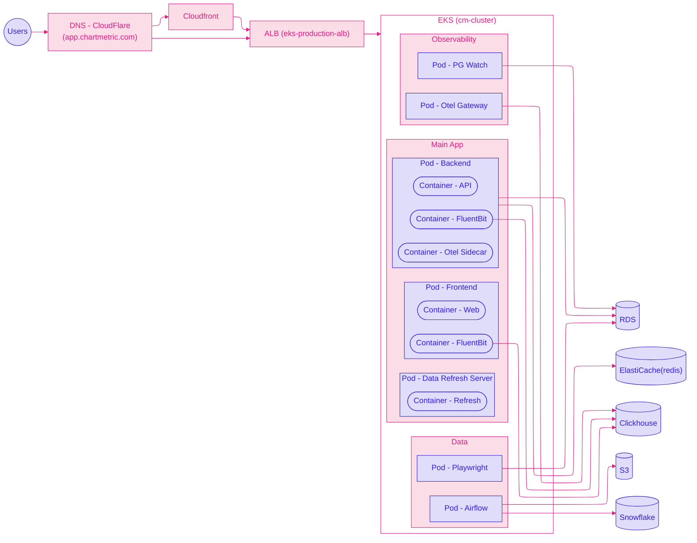

# 💚 ECS to EKS Migration Guide

> A beginner-friendly guide for junior engineers on migrating from Amazon ECS to Amazon EKS
> 
> This document captures everything I learned during Chartmetric's production migration so you don't have to learn it the hard way!
> 

## 💛 Before You Start…

### 🤍 Essential Concept

Before diving in, make sure you understand these concepts:

| Concept | What It Is | Why It Matters |
| --- | --- | --- |
| **Kubernetes (K8s)** | Container orchestration platform | The thing you're migrating TO |
| **ECS** | AWS's container service | The thing you're migrating FROM |
| **EKS** | AWS-managed Kubernetes | Kubernetes, but AWS handles the hard parts |
| **Terraform** | Infrastructure as Code | How we create all resources |
| **Pod** | Smallest K8s unit (1+ containers) | Replaces ECS "task" |
| **Deployment** | Manages pod replicas | Replaces ECS "service" |
| **Service** | Network endpoint for pods | How pods talk to each other |
| **Ingress** | External traffic routing | Replaces ALB listener rules |

### 🤍 The Big Picture



### 🤍 Overal Structure

```bash
EKS Cluster (cm_cluster)
│
├── Node Group: "general"
│   ├── Instance Type: m5.xlarge (4 vCPU, 16GB)
│   └── Scaling: 1-100 nodes
│
├── Node Group: "worker" # For Airflows
│   ├── Instance Type: m5.4xlarge (16 vCPU, 64GB)
│   └── Scaling: 1-100 nodes
│
├── Namespaces (one per environment):
│   ├── master (production)
        └── HPA: 4-16 pods
│   ├── staging
│   ├── sandbox1, sandbox2, ...
│   ├── ...
│   └── enterprise
│
└── Add-ons:
    ├── CoreDNS (service discovery)
    ├── VPC CNI (networking)
    ├── Metrics Server (for autoscaling)
    ├── Cluster Autoscaler (adds nodes when needed)
    └── AWS Load Balancer Controller (manages ALBs)
```

## 💛 IAM Setup

> **Goal**
> Create the IAM roles that EKS needs to function 

### 🤍 Why Do We Need IAM Roles?

EKS needs permission to:

1. **Cluster Role:** Let the **Kubernetes control plane** to manage the Kubernetes
2. **Node Role:** Let EC2 instances join the cluster and pull container images
3. **User Access:** Let **YOU (the human)** access the cluster

### 🤍 Cluster Role

This role is for the **EKS service itself**, not for you.

```hcl
# iam.tf

# Create the role
resource "aws_iam_role" "cm_cluster_role" {
  name = "eks_cluster_role"

  # This says "EKS service can assume this role"
  assume_role_policy = jsonencode({
    Version = "2012-10-17"
    Statement = [{
      Effect = "Allow"
      Principal = {
        Service = "eks.amazonaws.com"  # Only EKS can use this role
      }
      Action = "sts:AssumeRole"
    }]
  })
}

# Attach the required policy
resource "aws_iam_role_policy_attachment" "cluster_AmazonEKSClusterPolicy" {
  policy_arn = "arn:aws:iam::aws:policy/AmazonEKSClusterPolicy"
  role       = aws_iam_role.cm_cluster_role.name
}
```

### 🤍 Node Role

This role is for the **EC2 instances** (nodes) that run your pods.

```hcl
# Create the role
resource "aws_iam_role" "cm_node_role" {
  name = "eks_node_role"

  assume_role_policy = jsonencode({
    Version = "2012-10-17"
    Statement = [{
      Effect = "Allow"
      Principal = {
        Service = "ec2.amazonaws.com"  # EC2 instances can use this role
      }
      Action = "sts:AssumeRole"
    }]
  })
}

# Nodes need THREE policies:
resource "aws_iam_role_policy_attachment" "node_AmazonEKSWorkerNodePolicy" {
  policy_arn = "arn:aws:iam::aws:policy/AmazonEKSWorkerNodePolicy"
  role       = aws_iam_role.cm_node_role.name
}

resource "aws_iam_role_policy_attachment" "node_AmazonEKS_CNI_Policy" {
  policy_arn = "arn:aws:iam::aws:policy/AmazonEKS_CNI_Policy"
  role       = aws_iam_role.cm_node_role.name
}

resource "aws_iam_role_policy_attachment" "node_AmazonEC2ContainerRegistryReadOnly" {
  policy_arn = "arn:aws:iam::aws:policy/AmazonEC2ContainerRegistryReadOnly"
  role       = aws_iam_role.cm_node_role.name
}

```

**What each policy does:**

- `AmazonEKSWorkerNodePolicy` → Node can communicate with EKS control plane
- `AmazonEKS_CNI_Policy` → Node can set up networking for pods
- `AmazonEC2ContainerRegistryReadOnly` → Node can pull images from ECR

**Q. What If I Miss This Permission?**

You might get ‘Instances failed to join the kubernetes cluster’ error like below…

```bash
│ Error: waiting for EKS Node Group (cm_cluster:cm_cluster_node_group) create: unexpected state 'CREATE_FAILED', wanted target 'ACTIVE'. last error: i-05d29e8c69aa984c8: NodeCreationFailure: Instances failed to join the kubernetes cluster
│ 
│   with aws_eks_node_group.cm_cluster_node_group,
│   on cluster.tf line 48, in resource "aws_eks_node_group" "cm_cluster_node_group":
│   48: resource "aws_eks_node_group" "cm_cluster_node_group" {
```

### 🤍 User Access

<aside>

> **Note**
> Even if you're an AWS admin, you can't access EKS without explicit permission!

</aside>

 

**Q. What's the difference between Policy and Principal?**

- Principal = WHO (your IAM user ARN)
- Policy = WHAT they can do (admin, read-only, etc.)
</aside>

```hcl
# Import your IAM user
data "aws_iam_user" "my_user" {
  user_name = "your-username"  # Change this!
}

# Add yourself to the cluster's access list
resource "aws_eks_access_entry" "my_access" {
  cluster_name  = aws_eks_cluster.cm_cluster.name
  principal_arn = data.aws_iam_user.my_user.arn
  type          = "STANDARD"
}

# Give yourself admin permissions
resource "aws_eks_access_policy_association" "my_admin_access" {
  cluster_name  = aws_eks_cluster.cm_cluster.name
  policy_arn    = "arn:aws:eks::aws:cluster-access-policy/AmazonEKSClusterAdminPolicy"
  principal_arn = data.aws_iam_user.my_user.arn

  access_scope {
    type = "cluster"
  }
}
```

## 💛 Creating the EKS Cluster

### 🤍 The Cluster Itself

```hcl
# cluster.tf

resource "aws_eks_cluster" "cm_cluster" {
  name     = "cm_cluster"
  role_arn = aws_iam_role.cm_cluster_role.arn
  version  = "1.31"

  vpc_config {
    subnet_ids = local.subnet_ids  # At least 2 subnets in different AZs

    # Both should usually be true for production
    endpoint_private_access = true   # Nodes can reach API server
    endpoint_public_access  = true   # You can reach API server from laptop
  }

  # Wait for IAM to be ready
  depends_on = [
    aws_iam_role_policy_attachment.cluster_AmazonEKSClusterPolicy,
  ]
}
```

### 🤍 Node Groups

Node groups are pools of EC2 instances that run your pods.

```hcl
resource "aws_eks_node_group" "general" {
  cluster_name    = aws_eks_cluster.cm_cluster.name
  node_group_name = "general"
  node_role_arn   = aws_iam_role.cm_node_role.arn
  subnet_ids      = local.subnet_ids

  # Instance configuration
  instance_types = ["m5.xlarge"]   # 4 vCPU, 16 GB RAM
  capacity_type  = "SPOT"          # Save $$$! (but instances can be terminated)

  # Auto-scaling configuration
  scaling_config {
    desired_size = 3    # Start with 3 nodes
    min_size     = 1    # Never go below 1
    max_size     = 100  # Can grow to 100 if needed
  }

  # Labels help with pod scheduling
  labels = {
    workload = "general"
  }

  # Make sure IAM is ready first
  depends_on = [
    aws_iam_role_policy_attachment.node_AmazonEKSWorkerNodePolicy,
    aws_iam_role_policy_attachment.node_AmazonEKS_CNI_Policy,
    aws_iam_role_policy_attachment.node_AmazonEC2ContainerRegistryReadOnly,
  ]
}
```

<aside>

> **Tip: Spot vs On-Demand**
> 
> - **Spot:** Around 70% cheaper, but the resource can be interrupted by other aws resources.
> - **On-Demand:** Guaranteed availability, but more expensive
> - **Our choice:** Spot for most workloads (Because Kubernetes handles interruptions gracefully!)
</aside>

### 🤍 Essential Add-ons

These are like "plugins" that EKS needs to function properly:

```hcl
# DNS for service discovery (pods find each other by name - like a dns server in K8s)
resource "aws_eks_addon" "coredns" {
  cluster_name                = aws_eks_cluster.cm_cluster.name
  addon_name                  = "coredns"
  resolve_conflicts_on_create = "OVERWRITE"
  depends_on                  = [aws_eks_node_group.general]  # Needs nodes first!
}

# Networking (assigns IPs to pods)
resource "aws_eks_addon" "vpc_cni" {
  cluster_name                = aws_eks_cluster.cm_cluster.name
  addon_name                  = "vpc-cni"
  resolve_conflicts_on_create = "OVERWRITE"
}

# Network routing
resource "aws_eks_addon" "kube_proxy" {
  cluster_name                = aws_eks_cluster.cm_cluster.name
  addon_name                  = "kube-proxy"
  resolve_conflicts_on_create = "OVERWRITE"
}

# Metrics (needed for auto-scaling)
resource "aws_eks_addon" "metrics_server" {
  cluster_name                = aws_eks_cluster.cm_cluster.name
  addon_name                  = "metrics-server"
  resolve_conflicts_on_create = "OVERWRITE"
}
```

 

**Common Mistake**

Forgetting `depends_on` for CoreDNS. It needs at least one node to run on!

</aside>

## 💛 Networking & Security Groups

### 🤍 Why This Matters?

Let’s say your EKS pods need to talk to:

- **RDS** (database) → Port 5432
- **ElastiCache** (Redis) → Port 6379
- **Internet** (outbound) → For pulling images, external APIs like 3021

But by default, **the window is closed**. You must explicitly allow traffic.

### 🤍 EKS → RDS

```hcl
resource "aws_security_group_rule" "eks_to_rds" {
  description              = "Allow EKS to access RDS"
  type                     = "ingress"  # Traffic going INTO RDS
  from_port                = 5432       # PostgreSQL port
  to_port                  = 5432
  protocol                 = "tcp"

  # The RDS security group (you can find this in AWS console)
  security_group_id        = "sg-xxxxx"  # RDS security group

  # Allow traffic FROM the EKS cluster
  source_security_group_id = aws_eks_cluster.cm_cluster.vpc_config[0].cluster_security_group_id
}
```

### 🤍 EKS → Redis(ElastiCache)

```hcl
resource "aws_security_group_rule" "eks_to_redis" {
  description              = "Allow EKS to access Redis"
  type                     = "ingress"
  from_port                = 6379       # Redis port
  to_port                  = 6379
  protocol                 = "tcp"
  security_group_id        = "sg-yyyyy"  # Redis security group
  source_security_group_id = aws_eks_cluster.cm_cluster.vpc_config[0].cluster_security_group_id
}
```

### 🤍 ALB → EKS Pods

```hcl
# First, create a security group for the ALB
resource "aws_security_group" "alb" {
  name   = "eks-alb-sg"
  vpc_id = local.vpc_id

  # Allow HTTPS from internet
  ingress {
    from_port   = 443
    to_port     = 443
    protocol    = "tcp"
    cidr_blocks = ["0.0.0.0/0"]
  }

  # Allow HTTP (for redirect to HTTPS)
  ingress {
    from_port   = 80
    to_port     = 80
    protocol    = "tcp"
    cidr_blocks = ["0.0.0.0/0"]
  }

  # Allow all outbound
  egress {
    from_port   = 0
    to_port     = 0
    protocol    = "-1"
    cidr_blocks = ["0.0.0.0/0"]
  }
}

# Then allow ALB to reach EKS nodes
resource "aws_security_group_rule" "alb_to_eks" {
  type                     = "ingress"
  from_port                = 0
  to_port                  = 65535      # All ports (pods can be on any port)
  protocol                 = "tcp"
  security_group_id        = aws_eks_cluster.cm_cluster.vpc_config[0].cluster_security_group_id
  source_security_group_id = aws_security_group.alb.id
}
```

> **Debugging Tip**
> If your loadbalancer health checks fail with `Target.Timeout`, it's almost always a security group issue!

## 💛 Load Balancer

> This is the point section when you’re migrating the production with zero-downtime!

### 🤍 Create the ALB

```hcl
resource "aws_lb" "production" {
  name               = "eks-production-alb"
  internal           = false          # Internet-facing
  load_balancer_type = "application"
  security_groups    = [aws_security_group.alb.id]
  subnets            = local.public_subnet_ids  # Must be public subnets!

  # Prevent accidental deletion
  enable_deletion_protection = true # This prevents terraform from accidentally removing the resource
}
```

### 🤍 Create HTTPS Listener

```hcl
resource "aws_lb_listener" "https" {
  load_balancer_arn = aws_lb.production.arn
  port              = 443 # It should be 443 for https
  protocol          = "HTTPS"
  ssl_policy        = "ELBSecurityPolicy-TLS13-1-2-2021-06"
  certificate_arn   = data.aws_acm_certificate.wildcard.arn

  # Default action (if no rules match)
  default_action {
    type = "fixed-response"
    fixed_response {
      content_type = "text/plain"
      message_body = "Not Found"
      status_code  = "404"
    }
  }
}
```

### 🤍 Create Target Groups

```hcl
resource "aws_lb_target_group" "api" {
  name        = "eks-api-tg"
  port        = 80
  protocol    = "HTTP"
  vpc_id      = local.vpc_id
  target_type = "ip"  # Important! EKS uses IP targets, not instance

  health_check {
    enabled             = true
    path                = "/health"
    port                = "traffic-port"
    healthy_threshold   = 2
    unhealthy_threshold = 2
    interval            = 30
    timeout             = 5
  }
}
```

### 🤍 Create Listener Rules

```hcl
resource "aws_lb_listener_rule" "api" {
  listener_arn = aws_lb_listener.https.arn
  priority     = 100  # Lower number = higher priority

  # If the host header matches...
  condition {
    host_header {
      values = ["api.chartmetric.com"]
    }
  }

  # ...send to the API target group
  action {
    type = "forward"
    forward {
      target_group {
        arn    = aws_lb_target_group.api.arn
        weight = 100
      }
      # Session stickiness (user stays on same pod)
      # Some of chartmetric services reuires socket communication, so we're using sticky session
      stickiness {
        enabled  = true
        duration = 86400  # 24 hours
      }
    }
  }
}
```

### 🤍 Connect ALB to EKS (TargetGroupBinding)

This is the magic that automatically registers pods as ALB targets:

```hcl
resource "kubernetes_manifest" "api_tgb" {
  manifest = {
    apiVersion = "elbv2.k8s.aws/v1beta1"
    kind       = "TargetGroupBinding"
    metadata = {
      name      = "api-tgb"
      namespace = "master"  # The namespace where your pods run
    }
    spec = {
      serviceRef = {
        name = "chartmetric-api"  # The K8s service name
        port = 80
      }
      targetGroupARN = aws_lb_target_group.api.arn
      targetType     = "ip"
    }
  }
}
```
> **How it works**
> 
> 1. AWS Load Balancer Controller watches for `TargetGroupBinding` resources
> 2. When pods start/stop, it automatically registers/deregisters their IPs
> 3. You don't need to manage target registration manually!

## 💛 Managing Secrets

### 🤍 Background - The Problem

We have to ‘keep secret’ when we’re dealing with some variables (database passwords, API keys, etc.). To manage the variables secretly we’re using SSM(AWS System Manager). To import the variables from the SSM parameter store, we need to get them into `Kubernetes Secrets`.

### 🤍 Variable Flows

```
SSM Parameter Store → Terraform → Kubernetes Secrets → Pods
```

### 🤍 Fetch Secrets from SSM by Terraform

```hcl
# Get all parameters under /chartmetric/shared/
data "aws_ssm_parameters_by_path" "shared" {
  path      = "/chartmetric/shared/"
  recursive = true
}

# Get environment-specific parameters
data "aws_ssm_parameters_by_path" "environment" {
  for_each  = toset(["master", "staging", "sandbox1"])
  path      = "/chartmetric/${each.value}/"
  recursive = true
}
```

### 🤍 Create Kubernetes Secrets

```hcl
resource "kubernetes_secret" "api_secrets" {
  for_each = toset(["master", "staging", "sandbox1"])

  metadata {
    name      = "api-secrets"
    namespace = each.value
  }

  data = merge( # <- Overwriting the variables with more specific environments
    # Shared secrets (same for all environments)
    {
      for i, name in data.aws_ssm_parameters_by_path.shared.names :
      upper(replace(trimprefix(name, "/chartmetric/shared/"), "/", "_")) =>
      data.aws_ssm_parameters_by_path.shared.values[i]
    },
    # Environment-specific secrets
    {
      for i, name in data.aws_ssm_parameters_by_path.environment[each.key].names :
      upper(replace(trimprefix(name, "/chartmetric/${each.key}/"), "/", "_")) =>
      data.aws_ssm_parameters_by_path.environment[each.key].values[i]
    },
    # Computed values
    {
      "REDIS_HOST"       = "eks-main-redis.xxx.cache.amazonaws.com"
      "REDIS_KEY_PREFIX" = each.key
    }
  )
}
```

### 🤍 Use Secrets in Deployments

```hcl
# In your deployment spec:
env_from {
  secret_ref {
    name = "api-secrets"
  }
}
```

```hcl
# This value will WIN over anything in api-secrets
env {
  name  = "REDIS_HOST"
  value = "my-override-value.cache.amazonaws.com"
}

# This loads from secrets (but env above takes precedence)
env_from {
  secret_ref {
    name = "api-secrets"
  }
}
```

> **Debugging**
> `env` blocks always overwrites `env_from`!

## 💛 Deploying Applications

### 🤍 Basic Deployment
> You can simply understand as if writing deployment.yaml file by terraform syntax.

```hcl
resource "kubernetes_deployment" "api" {
  metadata {
    name      = "chartmetric-api"
    namespace = "master"
  }

  spec {
    replicas = 4  # Run 4 copies of the app

    # How to find pods that belong to this deployment
    selector {
      match_labels = {
        app = "chartmetric-api"
      }
    }

    # Pod template (recipe for creating pods)
    template {
      metadata {
        labels = {
          app = "chartmetric-api"
        }
      }

      spec {
        container {
          name  = "api"
          image = "<ecr-arn>:master"

          port {
            container_port = 3021
          }

          # Resource limits
          resources {
            requests = {  # Minimum guaranteed
              cpu    = "256m"   # 0.25 CPU
              memory = "512Mi"  # 512 MB
            }
            limits = {    # Maximum allowed
              cpu    = "2"      # 2 CPU
              memory = "4Gi"    # 4 GB
            }
          }

          # Health check - "Is the container alive?" <- Healthy container
          liveness_probe {
            http_get {
              path = "/health"
              port = 3021
            }
            initial_delay_seconds = 60   # Wait before first check
            period_seconds        = 30   # Check every 30s
            failure_threshold     = 3    # 3 failures = restart container
          }

          # Readiness check - "Can the container receive traffic?" <- Healthy app
          readiness_probe {
            http_get {
              path = "/health"
              port = 3021
            }
            initial_delay_seconds = 30
            period_seconds        = 10
            failure_threshold     = 3
          }

          # Load secrets
          env_from {
            secret_ref {
              name = "api-secrets"
            }
          }
        }
      }
    }

    # Rolling update strategy
    strategy {
      type = "RollingUpdate"
      rolling_update {
        max_surge       = "25%"   # Can temporarily have 25% extra pods
        max_unavailable = "25%"   # At most 25% can be unavailable
      }
    }
  }
}
```

### 🤍 Creating a Service
> Services == internal network endpoint

```hcl
resource "kubernetes_service" "api" {
  metadata {
    name      = "chartmetric-api"
    namespace = "master"
  }

  spec {
    type = "ClusterIP"  # Internal only (ALB handles external traffic)

    selector = {
      app = "chartmetric-api"  # Matches the deployment's pod labels
    }

    port {
      port        = 80    # Service listens on 80
      target_port = 3021  # Forwards to pod's 3021
    }
  }
}
```

### 🤍 Horizontal Pod Autoscaler (HPA)

We can automatically scale pods based on CPU/memory. We’re using this approach for special environments like production.

```hcl
resource "kubernetes_horizontal_pod_autoscaler_v2" "api" {
  metadata {
    name      = "chartmetric-api-hpa"
    namespace = "master"
  }

  spec {
    scale_target_ref {
      api_version = "apps/v1"
      kind        = "Deployment"
      name        = "chartmetric-api"
    }

    min_replicas = 2   # Never go below 2
    max_replicas = 32  # Can scale up to 32

    metric {
      type = "Resource"
      resource {
        name = "cpu"
        target {
          type                = "Utilization"
          average_utilization = 70  # Scale up when CPU > 70%
        }
      }
    }
  }
}
```

## 💛 Redis Configuration

### 🤍 The Setup

We create separate Redis clusters for different environment groups:

| Environment | Redis Cluster |  |
| --- | --- | --- |
| master (production) | eks-main-redis | Production needs isolation |
| enterprise | eks-enterprise-redis | Enterprise has own SLA |
| admin | eks-admin-redis | Admin site has own SLA |
| Other… | eks-shared-cluster-redis | We created one consolidated shared cluster which gives us huge cost savings – distinguishing each keys separately by the environment and endpoint! |

### 🤍 Define Redis in Environment Config

> **Tip**
> `ElastiCache` is an expensive AWS resource. When you choose the node type, think carefully if you really need ‘strong’ machine. Most of the case you don’t need that much expensive machine. 

```hcl
# environments.tf

local {
  main_app_deployments = [
    {
      environment_name = "master"
      redis_shape = {
        group_id  = "main"              # Uses eks-main-redis
        node_type = "cache.r6g.2xlarge" # Bigger for production
      }
    },
    {
      environment_name = "staging"
      # Doesn't have 'redes_shape' -> Use the default 'eks-shared-redis'
    },
    {
      environment_name = "enterprise"
      redis_shape = {
        group_id  = "enterprise"        # Uses eks-enterprise-redis
        node_type = "cache.r6g.large"
      }
    },
  ]
}
```

### 🤍 Create Redis Clusters

```hcl
# redis.tf

resource "aws_elasticache_replication_group" "eks_redis" {
  for_each = local.redis_groups

  replication_group_id = "eks-${each.key}-redis"
  description          = "Redis for ${each.key}"
  engine               = "redis"
  engine_version       = "6.2"
  node_type            = each.value.node_type
  num_cache_clusters   = 2  # Primary + replica for HA

  automatic_failover_enabled = true
  port                       = 6379
  security_group_ids         = [aws_security_group.redis.id]
  subnet_group_name          = aws_elasticache_subnet_group.redis.name
}
```

### 🤍 Connect Pods with Redis

```hcl
# In deployment spec:
env {
  name  = "REDIS_HOST"
  value = aws_elasticache_replication_group.eks_redis[
    try(each.value.redis_shape.group_id, "shared-cluster")
  ].primary_endpoint_address
}
```

## 💛 DNS & Traffic Migration

### 🤍 How Can We Migrate with Zero-Downtime?

1. ECS running, DNS points to `ECS ALB`
2. Deploy to EKS, `EKS ALB` created
3. Test EKS via direct ALB URL
    1. Or, I recommend to create temporal test subdomain
4. Switch DNS from `ECS ALB` → `EKS ALB`
    1. CNAME Record
5. Shut down ECS after you confirmed

> **Note**
> In our case, since the ALB and cluster were in different VPCs, this process was unavoidable.
> If you are not in such a special situation, I recommend performing a smooth migration by simply **adjusting the target groups of the load balancer** and weighted rules.

### 🤍 Create DNS Records

```hcl
resource "cloudflare_record" "api" {
  zone_id         = var.cloudflare_zone_id
  name            = "api"
  type            = "CNAME"
  content         = aws_lb.production.dns_name  # EKS ALB
  proxied         = false
  ttl             = 300
  allow_overwrite = true  # Important for migration!
}
```

> **allow_overwrite = true**
> - During migration, usually the record already exists (pointing to ECS)
> - This lets Terraform update it without failing


### 🤍 Update CloudFront

If using CloudFront, update the origin:

```hcl
resource "aws_cloudfront_distribution" "app" {
  origin {
    domain_name = aws_lb.production.dns_name  # Point to EKS ALB
    origin_id   = "eks-alb"

    custom_origin_config {
      http_port              = 80
      https_port             = 443
      origin_protocol_policy = "https-only"
      origin_ssl_protocols   = ["TLSv1.2"]
    }
  }
  ...
}
```

### 🤍 Attach WAF

Don't forget security!

```hcl
resource "aws_wafv2_web_acl_association" "alb" {
  resource_arn = aws_lb.production.arn
  web_acl_arn  = data.aws_wafv2_web_acl.production.arn
}
```
