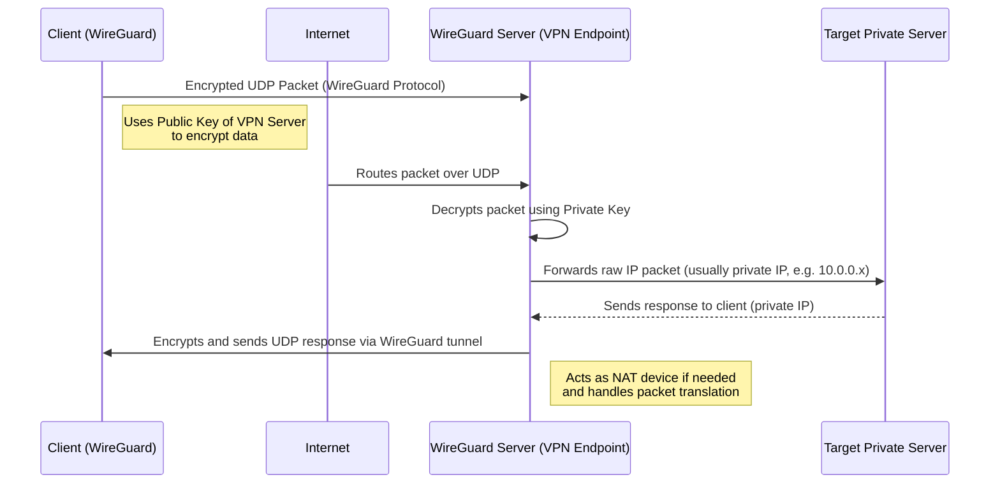

# 💚 How VPN Works?
## 💛 What is a VPN?
> **VPN = Virtual Private Network**

- It's a secure **tunnel between your device and the internet**.

    - which hides your data and your identity online.
    
## 💛 Why use a VPN?
- **Privacy**: Hides your IP and location

- **Security**: Encrypts your internet traffic (e.g., on public Wi-Fi)

- **Access**: Bypass censorship or geo-blocked content

## 💛 How VPN changes network behavior

- Without VPN:

    - Your packets are routed **directly to the destination**
    
    - Your **real IP address** is visible to websites
    
    - Your ISP (internet provider) **sees everything you do**
    
- With VPN:

    - Your packets are wrapped (tunneled) inside **encrypted packets**
    
    - These go to the **VPN server first**
    
    - VPN server unwraps them and forwards to final destination
    
    - Destination sees **VPN server's IP**, not yours
    
### 🤍 Networking Concepts Involved
- **IP Tunneling**: Your data is wrapped in another IP packet

- **Encryption protocols**: Like IPSec, WireGuard, OpenVPN

- **Routing Table**: Your OS updates routes so all (or some) traffic goes through VPN

- **NAT (Network Address Translation)**: VPN server rewrites packet headers to look like it’s from its own IP

## 💛 Types of VPNs
## 💛 What gets affected?
- **Routing**: All internet traffic can be routed to the VPN

- **DNS**: VPN may use private DNS to prevent leaks

- **Latency**: Can increase due to extra hops

- **Firewall/NAT Traversal**: VPN often uses UDP to get through firewalls

## 💛 Common VPN Protocols
## 💛 What does "encrypted" mean?
Encryption = locking your data so **only you and the VPN can read it**
Even your Wi-Fi provider or hackers at a cafe can’t see it.
## 💛 Common Use Cases
- Watch Netflix in another country

- Use public Wi-Fi safely

- Work securely from home

- Access blocked websites

## 💛 References
- [Mozilla - What is a VPN](https://foundation.mozilla.org/en/privacynotincluded/articles/what-is-a-vpn/)

- [Cloudflare - How VPNs Work](https://www.cloudflare.com/learning/network-layer/what-is-a-vpn/)

- [WireGuard](https://www.wireguard.com/)
